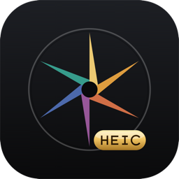
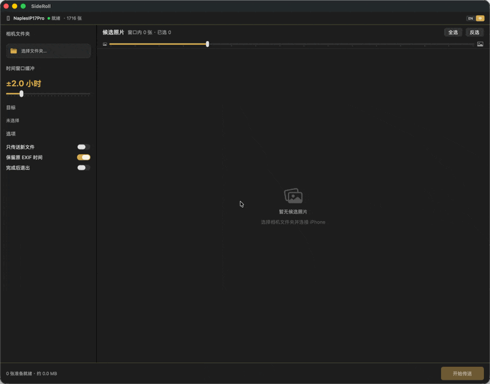

<p align="center">
  
</p>

<h1 align="center">SideRoll</h1>

<p align="center">
  <strong>中文</strong> · <a href="README_en.md">English</a>
</p>

<p align="center">
  <a href="https://github.com/naplesblue/sideroll/actions/workflows/ci.yml"></a>
  <a href="LICENSE"></a>
  
</p>

**把旅行期间用 iPhone 拍的照片，自动归档到相机文件夹 —— 按拍摄时间智能匹配。**

SideRoll 是一个 macOS 工具，面向同时使用相机和 iPhone 拍摄的摄影爱好者。旅行结束后，它会自动找出 iPhone 上与相机照片同一时间段内拍摄的照片，复制到相机文件夹中，省去在 Photos.app 里手动翻找、选片、导出的麻烦。

## 演示



## 工作流程

1. **选择相机文件夹** —— 拖拽或浏览到存放旅行 RAW 的文件夹
2. **自动时间匹配** —— SideRoll 读取相机文件的 EXIF 拍摄日期，生成时间窗口（± 可调缓冲），通过 USB 在 iPhone 上查找匹配的照片
3. **预览与勾选** —— 浏览候选缩略图，双击可预览原图
4. **导入** —— 选中的照片复制到子文件夹（默认 `iPhone/`），保留原文件名和 EXIF 时间戳

## 功能特性

- 📱 **USB 直连** —— 通过 ImageCaptureCore (PTP) 读取 iPhone，不依赖 iCloud
- 🕐 **智能时间匹配** —— 基于 EXIF 日期，±缓冲可调（默认 ±2 小时）
- 📸 **ProRAW 支持** —— DNG 优先显示，配对的 JPG/HEIC 自动隐藏
- 🎞️ **Live Photo 支持** —— 通过 `sidecarFiles` API 连同 `.MOV` 一起导入
- ✅ **重复检测** —— 已导入的文件自动变暗并取消选中
- 🔍 **原图预览** —— 双击缩略图即可全屏查看
- 🗂️ **RAW 格式回退** —— 无相机 RAW 时自动扫描顶层 JPG/HEIC 获取时间
- 🌙 **深色模式** —— 为暗色工作流设计
- 🌐 **中英双语** —— 内置语言切换，即时生效

## 系统要求

- macOS 15.4+
- iPhone 通过 USB 数据线连接
- iPhone 需解锁屏幕才能访问照片

## 支持的相机 RAW 格式

NEF/NRW (Nikon) · CR2/CR3/CRW (Canon) · ARW/SRF/SR2 (Sony) · RAF (Fujifilm) · ORF (Olympus/OM System) · RW2 (Panasonic) · PEF (Pentax) · RWL (Leica) · 3FR/FFF (Hasselblad) · IIQ (Phase One) · SRW (Samsung) · X3F (Sigma)

回退格式：JPG、HEIC、DNG、TIFF（当文件夹内无 RAW 文件时）

## 安装

### 从源码编译

```bash
git clone https://github.com/naplesblue/sideroll.git
cd sideroll
xcodebuild build -scheme SideRoll -configuration Release -destination 'platform=macOS'
```

编译产物位于 `DerivedData/Build/Products/Release/`。

### 下载预编译版本

从 [Releases](https://github.com/naplesblue/sideroll/releases) 页面下载最新版本。

### 首次启动

由于 SideRoll 未经 Apple 开发者签名，macOS Gatekeeper 会阻止直接打开。以下两种方式任选其一：

**方式一：右键打开（推荐）**

1. 打开 Finder，进入 `应用程序` 文件夹（或 DMG 拖入后的位置）
2. **右键点击** SideRoll.app → 选择 **打开**
3. 弹窗中点击 **打开** 即可（仅首次需要，之后可正常双击启动）

**方式二：终端移除隔离属性**

```bash
xattr -dr com.apple.quarantine /Applications/SideRoll.app
```

执行后即可正常双击启动，无需再次确认。

## 使用提示

- **iPhone 不显示？** 确保已解锁屏幕，并在 iPhone 弹窗中点击"信任"
- **调整缓冲**：侧边栏滑块可放大/缩小时间窗口。±2 小时适合一日游；多日行程可适当增大
- **子文件夹名称**：侧边栏可编辑，默认为 `iPhone`

## 已知限制

- 仅支持 USB 连接（不支持无线/iCloud）
- 一次只能连接一台 iPhone
- iOS PTP 协议不支持从 iPhone 删除文件
- 部分 DNG 缩略图通过 PTP 加载不稳定，已自动回退到配对 JPG/HEIC
- 视频文件无法通过 PTP 获取 EXIF，使用文件创建日期替代

## 许可证

[MIT](LICENSE)
